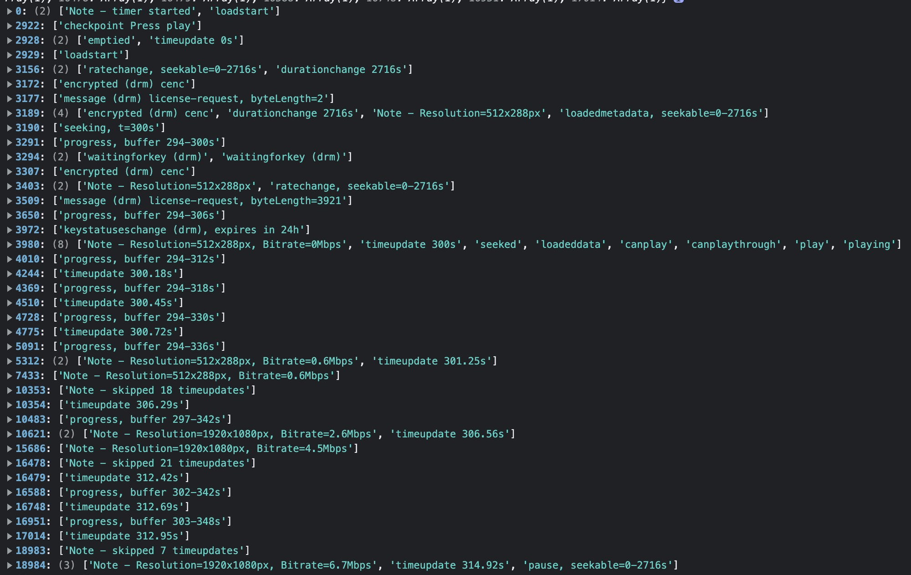
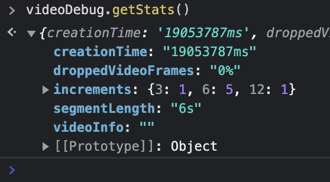

# html5-video-debug

html5-video-debug is a tool for debugging and optimising html5 players. It should work with any player based on HTMLMediaElement/video tag. The tool outputs a timeline log, which contains:

* all HTMLMediaElement events, and related video properties
* all MediaKeySession events (from Encrypted Media Extensions API) and some related drm properties
* buffered content from-to (s)
* seekable range from-to (s)
* first `video.currentTime` update (shown as `t=##s` in the log)
* drm protection scheme (i e CENC)
* size of "license request" to discriminate between service certificate requests and actual license requests (e g Widevine)
* video resolution (of actual stream, not video element size in app) (px)
* bitrate (webkit only) (Mb/s)
* segment size (s)
* dropped video frames (%)

## Installation
`npm install --save github:perqa/html5-video-debug.git`  
			    	--	OR --  
`npm install --save git+ssh://git@bitbucket.org/perqa/html5-video-debug.git`

## Usage
1. Import the module: `import Html5VideoDebug from 'html5-video-debug'`
1. Initialise it: `const videoDebug = new Html5VideoDebug();`
2. Add event listeners: `videoDebug.addEventListeners(video);`
1. Add deinit code (if applicable): `videoDebug.removeEventListeners();`
1. Make the debug object availabe in console: `window.videoDebug = videoDebug;`.

## Features
The initialised tool (videoDebug in the example above) returns an object containing the following:

* `addEventListeners`: [method with parameter `videoElement`]. Add event listeners. Pass in a video element as parameter.
* `removeEventListeners`: [method without parameter]. Remove event listeners. Suitable to call from a a reset method.
* `eventHistory`: [object]. This object contains the logs, a timeline of playback and drm events. The time in milliseconds is used as key. The value is an array which consists of all events that occurred during that millisecond.  
* `checkpoint`: [method with parameter `string`]. Can be used for adding a manual "checkpoint" to the timeline log, for example "Clicked Play button", which can potentially be used to measure video startup time.
* `resetTime`: [method	without parameter]. Resets time to zero, but does not stop the time measurement.
* `getStats`: [method	without parameter]. Returns an object with some additional statistics from the stream that played (partly experimental).
	* `droppedVideoFrames` (%). Percentage of `VideoPlaybackQuality.droppedVideoFrames` and `VideoPlaybackQuality.totalVideoFrames`.
	* `creationTime` (ms). `VideoPlaybackQuality.creationTime`: the number of milliseconds since the browsing context was created until the quality sample used for `droppedVideoFrames` was recorded.
	* `segmentLength` (s). Experimental (simple) algorithm to derive segment length. Inspect the `increments` object to verify the correctness of the estimate.
	* `increments`. This object contains a histogram of buffer increments in seconds, and is used to verify the `segmentLength` property. Buffer increment length in seconds is used as key, and the number of such increments as value.
	* `videoInfo`. Should contain video track info for those platforms that support it (Safari?)

## Example
In this example a video is started, played for 15s, and then paused. The image shows `videoDebug.eventHistory` for these 15s. On the left, we see the time in milliseconds, and on the right the events and other info.

<!--  -->

Please note that most `timeupdate` events are omitted automatically for brevity. However, all timeupdate events immediately following or preceding any other event will be kept in the log. Certain points in time see many events, like at 3980, where there are eight events logged during the same millisecond. The correct order of the events is always kept anyway, since events are pushed on to the array at each point in time.

Calling `videDebug.getStats()` returns 

<!--  -->

`getStats()` is still experimental, and basically only `segmentLength` and `droppedVideoFrames` are currently of interest.

